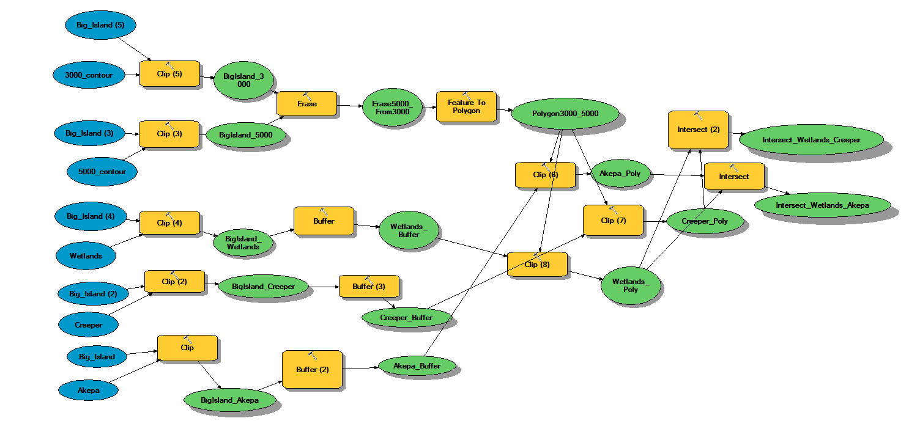

# Birds

### Project Overview
The main purpose of this project is to translate research material used to describe a spatial problem into a conceptual model of the problem in GIS. Specifically, to quantify the remaining Akepa and Hawaiian Creeper habitat as well as identify the locations within their remaining habitat in which they are at risk of contracting malaria in the Big Island (Hawaii). It includes determining a conceptual geoprocessing model prior to beginning the project and finalizing the documentation of the implemented geoprocessing model. All work/data for this project is saved in a geodatabase. 

### Introduction
The endemic landbirds of Hawaii, particularly the Hawaiian honeycreepers, an endemic subfamily of the cardueline finches, are one of the world's most dramatic examples of adaptive radiation and speciation (see glossary) in island ecosystems (Freed et al. 1987; Scott et al. 1988). From what is believed to have been a single successful colonization of the Hawaiian Archipelago by an ancestral species from North America, the honeycreepers evolved into a diverse array of species and subspecies of birds with bills ranging from thick, seed-eating beaks of the palila (Loxioides bailleui), to small insectivorous bills as seen on the `amakihi (Hemignathus virens), woodpecker-like adaptations of the `akiapola`au (H. munroi), and large, decurved nectar-feeding bills of the `i`iwi (Vestiaria coccinea).

Of the historically documented 71 taxa of endemic Hawaiian birds, 23 are now extinct, and 30 of the remaining 48 species and subspecies are listed as endangered or threatened by the U.S. Fish and Wildlife Service (USFWS 1992), many with few or only single populations remaining.

Many factors have been suggested to explain the decline of Hawaiian bird species since human colonization (Ralph and van Riper 1985; Scott et al. 1988). The most important and plausible of these include habitat loss (Berger 1981; Kirch 1982; Olson and James 1982; Jacobi and Scott 1985), susceptibility to introduced avian diseases (Warner 1968; Ralph and van Riper 1985; van Riper et al. 1986), predation by introduced mammals (Atkinson 1977), and competition from introduced birds (Mountainspring and Scott 1985) and arthropods (Perkins 1903; Banko and Banko 1976). Although no one factor is believed to be the single cause for the loss or decline of the Hawaiian birds, many biologists believe that habitat loss and avian diseases have had the greatest effect on native birds.

Warner (1968) first identified pox and malaria as major pathogens of native forest birds. Van Riper et al. (1986) demonstrated that the highest incidence of malaria occurs in wet mid-elevation forests (between 900 m [3,000 ft] and 1,500 m [5,000 ft]) where populations of Culex mosquitoes overlap with highly susceptible native birds. Current investigations support these observations. Surveys for other disease agents identified several potentially pathogenic parasites and bacteria, but none has been implicated as a significant cause of mortality (van Riper and van Riper 1985).

The above was taken from: https://pubs.er.usgs.gov/publication/94800

### Spatial Data Collected 
>   * Hawaiian Islands 
>   * Habitat for the Akepa and Hawaiian Creeper species
>   * Wetland areas 
>   * A Digital Elevation Model (DEM) for the Big Island
The spatial data was collected from https://data.usgs.gov/datacatalog/

### Geoprocessing Methods

>   * Select Big Island using “Select” tool then create layer from selected feature
>   * Clip Akepa layer to Big Island
>   * Clip Creeper layer to Big Island 
>   * Clip wetlands layer to Big Island 
>   * Clip contours layer to Big Island
>   * Create layer from 3000 ft. contour
>   * Create layer from 5000 ft. contour
>   * Use “Erase” tool to erase 5000 polygon from 3000 polygon and create target elevation layer
>   * Buffer wetlands to 50 meter 
>   * Buffer Akepa to 150 meter 
>   * Buffer Creeper to 150 meter 
>   * Clip 3 buffered wetlands (mosquitos) to elevation polygon 
>   * Intersect dangerous mosquitos with the buffered Akepa 
>   * Intersect dangerous mosquitos with the buffered Creeper
>   * Add hillshade background on maps 

### Final Map

### Conclusion
Based on the final map shown above, six percent of the overall distribution of the honeycreepers and akepa in Hawaii overlaps with the wetlands dominated by mosquitos that means these areas are the endangered habitats for both the akepa and honeycreepers. It is evident that the endangered habitats for the honeycreepers and akepa are highly related due to their occurrence in the northeastern part of the island. 

